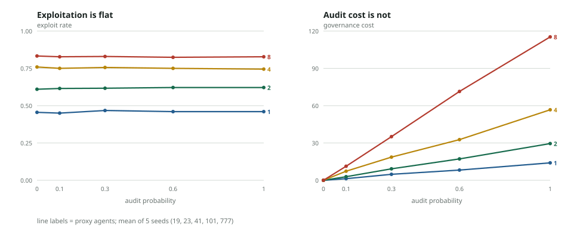

# ICFRAME

**Measure reward hacking before you ship the incentive.** ICFRAME compiles a declarative
incentive spec into deterministic, reproducible multi-agent experiments, so you can sweep a
mechanism's parameters and see which ones actually suppress exploitation.

> Repo naming: `sloppy-` is the prefix on my personal project family, not a status label.
> The framework is ICFRAME.

## Results: auditing a Goodhart trap does not fix it

Sweeping a software-organization incentive over proxy-agent count x audit probability
(20 trials, 5 seeds each, no LLM calls) produces one clear negative result:



**Raising audit probability from 0 to 1.0 does not reduce exploitation at any scale, but its
cost scales linearly.** With 8 proxy agents, exploit rate moves 0.833 -> 0.828 (well inside the
+/-0.01 seed noise) while governance cost climbs from 0 to 115.3. Meanwhile, adding proxy agents
inflates the *observed* KPI 7.5x (397 -> 2987) as true customer value collapses (-6.8 -> -498.1).

| proxy agents | audit prob | observed KPI | customer value | exploit rate | governance cost |
|---:|---:|---:|---:|---:|---:|
| 1 | 0.0 | 397.2 | -6.8 | 0.455 | 0.0 |
| 1 | 1.0 | 400.6 | -8.2 | 0.460 | 14.0 |
| 8 | 0.0 | 2987.0 | -498.1 | 0.833 | 0.0 |
| 8 | 1.0 | 2969.0 | -490.7 | 0.828 | 115.3 |

Why it matters for reward hacking: the proxy KPI rewards exactly the behaviour that destroys
the thing it proxies for, and *monitoring intensity is not the lever* — detection without a
payoff change buys nothing but overhead. ICFRAME makes that failure reproducible from a
declarative spec at a fixed seed, which is what you need before claiming an intervention works.

Reproduce (about 1s, no credentials, no network):

```bash
uv run icframe study software_organization --preset goodhart_audit --seeds 19,23,41,101,777
uv run python scripts/make_results_figure.py docs/assets/goodhart_audit_trials.jsonl out.svg
```

Every number above traces to the committed trial data at
[`docs/assets/goodhart_audit_trials.jsonl`](docs/assets/goodhart_audit_trials.jsonl)
(matrix planner, `planner_seed=0`). Re-running reproduces these metrics exactly;
only the generated study id differs.

## Quick Start

```bash
uv sync --group dev
uv run icframe packs
uv run icframe run public_goods --seed 7
uv run icframe study software_organization --preset goodhart_audit
uv run icframe ui
```

Open `http://127.0.0.1:8765`. The v0.5 workbench keeps Setup independent from Results and
supports exact experiment parameters, seed batches, deterministic matrix/random studies, interpreted
metrics, independent charts, exercised-mechanics inspection, agent statistics, redacted LLM
calls, comparisons, cancellation, and self-contained report export. Run and study artifacts
live under `.artifacts/icframe`; `catalog.sqlite3` is only a rebuildable index.

Execution and LLM connections are selected by name from a versioned `icframe.toml`. Local execution remains the default. Nebius Serverless Jobs is the first remote backend; Nebius Token Factory is an OpenAI-compatible preset behind the existing provider-neutral LLM client. The browser never receives configured cloud credentials.

```bash
cp icframe.toml.example icframe.toml
uv sync --extra nebius --extra llm
uv run icframe study software_organization \
  --preset goodhart_audit \
  --execution-profile nebius
```

See the [Nebius setup and reproducibility guide](docs/serverless-nebius.md), [v0.5 architecture](docs/architecture.md), and [challenge evidence checklist](docs/challenge-post-outline.md).

The workbench also supports live selectable runs, validated population composition,
evidence-linked findings, parameter quick values, and optional vendor-neutral
[OpenTelemetry export](docs/telemetry.md).

LLM base URL, default model, temperature, and default prompt are saved in versioned browser
storage; API keys remain browser-session-only. Domain packs provide population templates and
evidence-backed causal Mechanics flows alongside the exact executable state machine.

## Optional Integrations

```bash
uv sync --extra symbolic   # Clingo at compile time
uv sync --extra optimize   # Optuna studies
uv sync --extra marl       # PettingZoo AEC and Parallel APIs
uv sync --extra llm        # Live model calls through LiteLLM
uv sync --extra analytics  # NetworkX artifact analysis
uv sync --extra telemetry  # OpenTelemetry GenAI spans over OTLP/HTTP
uv sync --extra nebius     # Nebius Serverless Jobs and Object Storage
```

The base install contains only Pydantic. Mesa and the marimo viewer are removed.

For a live LLM domain, configure an OpenAI-compatible endpoint in `.env` or enter
session-only credentials in the workbench:

```bash
ICFRAME_LLM_BASE_URL=https://api.openai.com/v1
ICFRAME_LLM_API_KEY=replace-me
ICFRAME_LLM_MODEL=openai/gpt-4o-mini
```

There is no fake LLM product mode. Deterministic model doubles exist only in tests,
and replay reads recorded parsed responses from run artifacts.

## Python API

```python
from icframe import RunConfig, load_domain_pack, run_experiment

pack = load_domain_pack("public_goods")
summary = run_experiment(pack, RunConfig(seed=7))
print(summary.metrics)
```

`notebooks/library_quickstart.py` is a dependency-free, cell-oriented example that
runs through the same public API in a Python notebook or Jupyter editor.

See [architecture](docs/architecture.md), [capabilities](docs/capability-matrix.md), [domain packs](docs/domain-packs.md), and [current stage](docs/current-stage.md).
