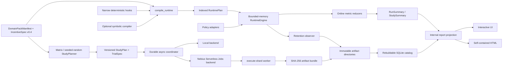

# ICFRAME v0.5 Architecture

ICFRAME is a compiled incentive-simulation core with a profile-driven local or serverless execution plane. Files are authoritative; SQLite is a rebuildable query index.



## Boundaries

- Pydantic models validate TOML, JSON artifacts, optional-adapter inputs, and HTTP requests.
- Internal execution uses indexed dataclasses and streaming reducers.
- `compile_runtime` resolves transitions, visibility, metric dependencies, symbolic availability, conflicts, and policy factories once.
- Hooks may initialize state, patch state before a step, emit effects after commit, or terminate. They receive immutable snapshots and supplied randomness. They cannot select actions, perform I/O through the contract, or bypass validation.
- Sequential schedules observe the latest committed state. Parallel schedules observe one immutable snapshot and commit by sorted agent ID. Shared non-add updates are compile errors.
- PettingZoo wrappers translate their API cycles into engine steps. AEC action buffering stays in the adapter rather than adding AEC state to the engine.
- The trusted metric and evaluation definitions are hashed at compilation and checked before a summary can be produced.

## Public API

```python
from icframe import (
    compile_runtime,
    load_domain_pack,
    replay_run,
    run_experiment,
    run_study,
)
```

The canonical contracts are `load_domain_pack`, `compile_runtime`, `run_experiment`, `run_study`, and `replay_run`. Runtime compatibility for legacy JSON and IncentiveSpec v0.2/v0.3 does not exist.

v0.5 adds `submit_run`, `submit_study`, `get_job`, `cancel_job`, and `sync_jobs`. The coordinator persists a manifest and append-only log before it contacts a backend. Remote jobs can be reconstructed and polled after a controller restart; local in-process work is marked interrupted.

## Remote artifact boundary

Each worker receives explicit trial identities plus effective pack and runtime hashes. It writes a schema-versioned compressed bundle and completion marker. The controller rejects unsafe archive members, mismatched logical IDs, file lists, schemas, and SHA-256 values before atomically importing the result. Trial numbers make collection idempotent. Object Storage is transport and recovery storage; imported local artifacts remain authoritative.

## Retention

| Profile | Retained data |
| --- | --- |
| `audit` | Every observation, decision, constraint explanation, event, LLM call, and external action |
| `experiment` | Online metrics, bounded checkpoints, sampled first/last diagnostics, violations, enforcement, failures, LLM calls, and external actions |
| `training` | Normalized replay inputs and bounded episode/trial summaries only |

All metrics consume every event online regardless of retention. Policy memory is bounded by the compiled state/action space. LLM-visible history is bounded by its visibility profile.

## Optional Adapters

- `icframe[symbolic]`: Clingo compilation and cached explanations
- `icframe[optimize]`: Optuna single and Pareto studies
- `icframe[marl]`: PettingZoo AEC and Parallel environments
- `icframe[llm]`: live model calls through LiteLLM
- `icframe[analytics]`: NetworkX interaction analysis over retained events
- `icframe[nebius]`: official Nebius SDK and Object Storage transport

Mesa is not part of v0.4. MARL training algorithms remain outside ICFRAME.
Agno is not a core runtime: a future tool-using agent integration may implement the
existing `Policy` contract without replacing simulation scheduling or state.
